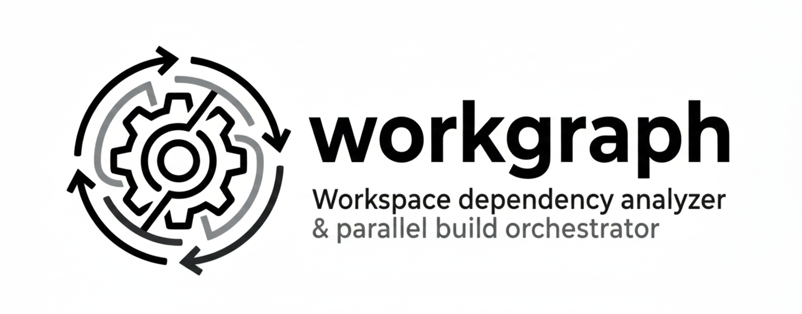

<div align="center">
  <picture>
    <source media="(prefers-color-scheme: dark)" srcset="assets/logo-dark.png">
    <source media="(prefers-color-scheme: light)" srcset="assets/logo.png">
    
  </picture>
</div>

## Features

- **Dependency Graph Analysis** - Scans workspace projects and builds a directed dependency graph
- **Cycle Detection** - Detects circular dependencies using DFS with coloring
- **Affected Project Detection** - Determines which projects are affected by changes (transitive dependents)
- **Parallel Build Planning** - Uses Kahn's algorithm to plan build waves (parallel within wave, sequential between waves)
- **File Watching** - Monitors file changes with debouncing and triggers rebuilds
- **Dev Server Management** - Start and manage multiple dev servers with prefixed output
- **Concurrent Execution** - Executes builds with configurable concurrency limits
- **Source Generation** - Automatically run code generators for missing/generated sources
- **Terminal UI** - Split-screen interface with tasks panel, build logs, and task output

## Usage

Run directly with npx:

```bash
npx workgraph <command>
```

## CLI Commands

### Analyze Dependencies

Show the dependency graph and detect cycles:

```bash
workgraph analyze
```

Output:
```
Analyzing workspace at: /path/to/workspace

Found 6 projects

Dependency Graph:
  @myorg/api (apps/api)
    -> @myorg/auth
  @myorg/auth (libs/auth)
    (no dependencies)
  @myorg/web (apps/web)
    -> @myorg/api

No cycles detected
```

### Scan for Unknown Dependencies

Detect imports that can't be resolved (e.g., generated code folders):

```bash
workgraph scan
```

Output when missing dependencies are found:
```
Scanning workspace at: /path/to/workspace

Scanning 5 projects for unknown dependencies...

Unknown dependencies detected:

  @myorg/web-angular:
    - apps/web-angular/src/generated (in .gitignore)
      Imported from: apps/web-angular/src/app/app.component.ts
        (and 4 more files)

To configure generated sources, add to your root package.json:

  "workgraph": {
    "sources": {
      "apps/web-angular/src/generated": "<command to generate>"
    }
  }
```

Output when sources are configured:
```
Configured sources:
  apps/web-angular/src/generated
    -> npx exposify-codegen api -o ./apps/web-angular/src/generated

No unknown dependencies found
```

### Plan Build

Show what would be built for specific changes:

```bash
# By package name
workgraph plan -c @myorg/auth

# By shorthand name
workgraph plan -c auth

# By path
workgraph plan -c libs/auth

# Multiple changes
workgraph plan -c auth -c utils
```

Output:
```
Changed: @myorg/auth, @myorg/utils
Affected: @myorg/api, @myorg/auth, @myorg/utils, @myorg/web

Build Plan:
  Wave 1 (parallel): @myorg/auth, @myorg/utils
  Wave 2: @myorg/api
  Wave 3: @myorg/web

Total: 4 projects in 3 waves
```

### Build Affected Projects

Execute the build plan:

```bash
# Build all
workgraph build

# Build affected by specific changes
workgraph build -c auth

# Dry run (show plan without executing)
workgraph build -c auth --dry-run

# With custom concurrency
workgraph build -c auth --concurrency 2
```

### Watch Mode

Watch for file changes and automatically rebuild affected projects:

```bash
# Watch all projects
workgraph watch

# Watch all, but only rebuild libs (for dev with app servers)
workgraph watch --filter 'libs/*'

# Watch libs + start app dev servers
workgraph watch --filter 'libs/*' api web

# Dry run mode
workgraph watch --dry-run
```

**Dev workflow (single terminal):**
```bash
# Watch libs + start API and web dev servers
workgraph watch --filter 'libs/*' api web
```

### Terminal UI

Watch mode displays a 3-panel terminal interface:

```
┌─ Tasks ─────┬─ Workgraph ──────────────┬─ Task Output ──────────────┐
│ ● api 12345 │ [14:32:01] Watching...   │ [api] Server started       │
│ ● web 12346 │ [14:32:05] Building auth │ [web] Compiled successfully│
│ ○ build:auth│ [14:32:06] auth: done    │                            │
└─────────────┴──────────────────────────┴────────────────────────────┘
```

**Panels:**
- **Tasks** - Running processes with status icons and PIDs
- **Workgraph** - Build logs with timestamps
- **Task Output** - Dev server and build output

**Task Status Icons:**
- `●` green - Running
- `○` gray - Stopped
- `✖` red - Error

**Navigation:**
- `Tab` - Switch focus between panels
- `Ctrl+C` - Stop all processes and exit

To disable the UI and use plain console output:
```bash
workgraph watch --no-ui
```

## CLI Options

| Option | Description | Default |
|--------|-------------|---------|
| `-r, --root <path>` | Workspace root directory | `process.cwd()` |
| `-c, --changed <projects...>` | Changed projects (names or paths) | `[]` |
| `--concurrency <number>` | Max parallel builds | `4` |
| `--debounce <ms>` | Debounce time for watch mode | `200` |
| `--dry-run` | Show plan without executing | `false` |
| `--filter <pattern>` | Only build projects matching pattern (e.g., `libs/*`) | - |
| `--no-ui` | Disable split-screen terminal UI (watch mode) | `false` |
| `--verbose` | Show detailed watcher output | `false` |

## Source Generation

Configure automatic source generation for generated code (e.g., client code from API schemas).

### Configuration

Add `workgraph.sources` to root or any project's `package.json`. Per-project configs automatically run from the project directory and target that project.

**Per-project config** (recommended) - in `apps/api/package.json`:
```json
{
  "workgraph": {
    "sources": {
      "api": {
        "command": "bun run codegen --output src/generated",
        "deps": []
      }
    }
  }
}
```

**Root config** - in root `package.json`:
```json
{
  "workgraph": {
    "sources": {
      "web-client": {
        "command": "npx exposify-codegen api --output ./apps/web/src/generated",
        "deps": ["api"],
        "target": "@myorg/web"
      }
    }
  }
}
```

### Configuration Options

| Field | Description |
|-------|-------------|
| `command` | Shell command to run (or use string shorthand) |
| `deps` | Source generators that must run first. Empty = no dependencies. |
| `cwd` | Working directory (auto-set for per-project configs) |
| `target` | Project that depends on this generator's output (auto-set for per-project configs) |

### How It Works

1. **Auto-targeting**: Sources in a project's `package.json` automatically target that project
2. **Build ordering**: Generators run **before** their target project builds
3. **Topological sort**: Generators are sorted by `deps` - dependencies run first

### Example: API with Generated Code

If `@myorg/api` imports from `src/generated/`, define the generator in `apps/api/package.json`:

```json
{
  "name": "@myorg/api",
  "workgraph": {
    "sources": {
      "api-types": {
        "command": "bun run generate-types",
        "deps": []
      }
    }
  }
}
```

Build order:
1. Build libs (`@myorg/utils`, `@myorg/auth`)
2. **Generate `api-types`** ← runs before api build
3. Build `@myorg/api` ← succeeds because generated code exists

### Example Output

```
$ workgraph watch api web --no-ui

[14:32:01] Building 3 dependencies first...
[14:32:01] Building: @myorg/utils (wave 1/3)
[14:32:02] @myorg/utils: done (850ms)
[14:32:02] Building: @myorg/auth (wave 2/3)
[14:32:03] @myorg/auth: done (550ms)
[14:32:03] Generating: api-types
[14:32:03] Generated successfully
[14:32:03] Building: @myorg/api (wave 3/3)
[14:32:05] @myorg/api: done (1400ms)
[14:32:05] Dependencies built successfully
[14:32:05] Generating: web-client
[14:32:06] Generated successfully
[14:32:06] Starting dev server: @myorg/api
[14:32:06] Starting dev server: @myorg/web
```

## Programmatic API

```typescript
import {
  loadWorkspaceProjects,
  buildGraph,
  detectCycles,
  getAffectedProjects,
  planWaves,
  executePlan,
  createWatcher,
} from 'workgraph';

// Load workspace projects
const projects = await loadWorkspaceProjects('/path/to/workspace');

// Build dependency graph
const graph = buildGraph(projects);

// Check for cycles
const cycles = detectCycles(graph);
if (cycles) {
  console.error('Cycles detected:', cycles);
}

// Get affected projects
const changed = new Set(['@myorg/auth']);
const affected = getAffectedProjects(changed, graph.rdeps);

// Plan build waves
const waves = planWaves(affected, graph.deps);
// Result: [['@myorg/auth'], ['@myorg/api'], ['@myorg/web']]

// Execute build plan
const result = await executePlan(waves, projects, '/path/to/workspace', {
  concurrency: 4,
  dryRun: false,
});
```

## Algorithm Details

### Dependency Graph

The library builds two maps:
- `deps[A] = Set<B>` - A depends on B
- `rdeps[B] = Set<A>` - B is a dependency of A (reverse graph)

Dependencies are collected from:
- `dependencies`
- `devDependencies`
- `peerDependencies`
- `optionalDependencies`

### Cycle Detection

Uses DFS with three-color marking:
- WHITE (0): Unvisited
- GRAY (1): Currently visiting (in stack)
- BLACK (2): Fully visited

A back edge to a GRAY node indicates a cycle.

### Wave Planning (Kahn's Algorithm)

1. Build induced subgraph from affected projects
2. Calculate in-degree for each node (count of unbuilt dependencies)
3. Repeat until all nodes processed:
   - Wave N = all nodes with in-degree 0
   - Remove wave nodes and decrement dependents' in-degrees

Projects in the same wave have no dependencies on each other and can be built in parallel.

### Affected Detection

Uses BFS on the reverse dependency graph:
1. Start with changed projects
2. Add all transitive dependents via `rdeps`
3. Result includes original changes + all projects that depend on them

## Ignored Paths

The watcher ignores these patterns by default:
- `**/node_modules/**`
- `**/dist/**`
- `**/.angular/**`
- `**/.nx/**`
- `**/coverage/**`
- `**/*.log`
- `**/.git/**`
- `**/tmp/**`
- `**/.cache/**`

## Root Config Changes

Changes to root configuration files trigger a rebuild of all projects:
- `package.json`
- `package-lock.json`
- `pnpm-lock.yaml`
- `yarn.lock`
- `tsconfig.json`
- `tsconfig.base.json`

## Publishing

See [RELEASING.md](./RELEASING.md) for publishing instructions.

## License

MIT
